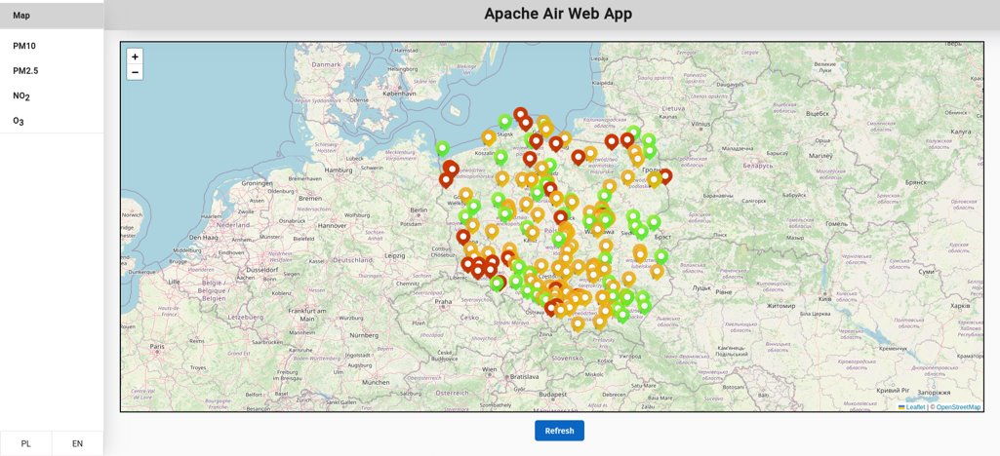

# apache-air

Projekt na przedmiot Big Data Analytics zrobiony wspólnie z:
[Pawłem](https://github.com/wesolowskip), [Krystianem](https://github.com/KrystianKurek) i [Stanisławem](https://github.com/matuszewskis).

Celem projektu było zbudowanie systemu do przewidywania zanieczyszczenia powietrza w oparciu o technologie Big Data.



## Setup i najważniejsze rzeczy

**UWAGA** Docker może się nie lubić z Windowsem!!!

Należy najpierw utworzyć plik w katalogu głównym repo `.env` i w nim wstawić linijkę:

```
OPENWEATHER_API_KEY=<klucz api>
```

Plik nie jest śledzony przez gita!

Klucz należy wziąć z https://home.openweathermap.org/api_keys.

Potem:

```docker compose up```

Potem wchodzimy w NiFi (patrz niżej) i na głównej ProcessGroupie PPM "Enable all controller services" i "Start".

Następnie attachujemy shella do kontenera spark-master i w nim wywołujemy skrypt `/home/base_models_learning/start_streaming.sh`. Pierwsze realtime viewsy pojawią się za kilka minut (postawienie tego joba też chwilę trwa). Kod w pythonie jest w katalogu `REPO/spark/base_models_learning/streaming.py`.

Żeby sprawdzić zawartość cassandry można się attachować do kontenera cassandra i w nim `cqlsh` i potem `SELECT * from apache_air.realtime_views;`.

Poza streamingiem mamy jeszcze skrypt `REPO/spark/base_models_learning/train_base.sh` i odpowiadający `REPO/spark/base_models_learning/train_base.py`.

### Problemy z Windowsem
W przypadku różnego rodzaju problemów, w szczególności rzeczy pokroju "file not found" w NiFi (skrypty, które są kopiowane do kontenera) należy się upewnić, czy zakończenia linii w tych plikach mamy faktycznie LF. Jeśli są CRLF to trzeba zmienić. Tyczy się to wszystkich plików `.sh` w repo. Może też pomóc stawianie kontenerów z opcją `--force-recreate` czy jakoś tak.


## Nifi
Nifi stoi na https://localhost:8443/nifi

User: admin
Password: adminadminadmin

Docker compose up automatycznie podłaczy nifi do kontenra nifi-registry. Nifi zaciągnie odpowiedni flow (skrypt do tego to `nifi/flow_setup.sh`).
Jesli chcemy wprowadzić zmiany we flowie to robimy:
- w Nifi mamy jeden główny bloczek z całym flowem (`FlowPG`), wchodzimy w niego i dostajemy dwa bloczki, które dotyczą powietrza i pogody
- Tutaj wprowadzamy zmiany, jakie chcemy
- Wracamy w górę (strzałka w górę w lewnym panelu), tak by widzieć tylko 1 bloczek na planszy. Klikamy kontrola wersji na nim, komitujemy
- W skrypcie `nifi/flow_setup.sh` podbijamy wersję w jsonie `VERSION_CONTROL`, by po postawieniu kontener ładował odpowiednią wersję

Szczegóły wersji można sprawdzić na http://localhost:18080/nifi-registry (tu stoi repo z flowem). Pamiętamy, by na gita zakomitować pliki z katalogu `nifi-registry`!!!!


## Kafka

Sprawdzenie, że kafka działa:

1. Attachujemy shella do kontenera z kafką po jego uruchomieniu

2. `kafka-console-consumer --topic air-data --from-beginning --bootstrap-server localhost:9092`

3. `kafka-console-consumer --topic weather-data --from-beginning --bootstrap-server localhost:9092`

Instrukcje 2. i 3. powinny printować na bieżąco dane przychodzące do kolejek z NiFi

## Hadoop

Hadoop namenode:
  https://localhost:9870
Hadoop datanode:
  https://localhost:9864
  

Żeby podejrzeć parquety:

1. Odpalamy namenode'a w terminalu (najłatwiej z plugina vscode)
2. hadoop dfs -ls /tmp listuje katalogi z danymi potem np. hadoop dfs -ls /tmp/WEATHERRESULTS listuje pliki
3. Kopiujemy wybrany plik do normalnego filesystemu namenode'a np : hadoop fs -get /tmp/WEATHERRESULT/nazwa_pliku /tmp/nazwa_pliku
4. Kopiujemy z namenode'a do naszej maszyny np: docker cp namenode:/tmp/nazwa_pliku nazwa_pliku
5. Odpalamy pythona3 i wywołujemy import pandas as pd -> pd.read_parquet('nazwa_pliku')
6. pandas się wywala i mówi że trzeba coś tam zainstalować żeby używać read_parquet
7. install tego przez co wywala
8. read_parquet ponownie
9. koniec

## Spark

Póki co jest jeden master i 2 workernody. Workernody mają po 1 CPU i 1GB RAM. Jeśli trzeba zwiększyć, to w `docker-compose.yaml` odpowiednio zmieniamy.
Sparki są na portach (localhost):

- 8888 (master),
- 8889, 8890 (workery).

### Dostęp ze Sparka do hadoopa

Żeby zweryfikować, czy mamy dostęp do parquetów z hadoopa:

1. Attachujemy shella do hadoop namenoda, robimy `hdfs dfs -ls /tmp/AIRRESULTS` lub `hdfs dfs -ls /tmp/WEATHERRESULTS`. Upewniamy się, że mamy chociaż 1 parquet.
2. Attachujemy shella do któregoś z workerów sparka. Odpalamy sparka `/spark/bin/pyspark`.
3. W konsoli sparka wpisujemy `spark.read.parquet("hdfs://namenode:8020/tmp/AIRRESULTS")` (albo z `WEATHERRESULTS`). Oczywiście jak chcemy konkretny parquet to można dospecyfikować ścieżkę. Możemy też zrobić na tej ramce `.collect()`. Voilà!

## Cassandra

Cassandra chwilę startuje (< 1min). Kiedy jest gotowa, to kontener init-cassandra się wyłącza.
Żeby podejrzeć tabelkę, można np.:

1. Attachować się do kontenera cassandry
2. `cqlsh`
3. `describe tables;`
4. `SELECT * FROM apache_air.batch_views;`

Wstawianie np.:

5. `INSERT INTO apache_air.batch_views (timestamp, particle, interval, mre) VALUES ('2011-02-03 04:05', 'NO', 1, 54.34);`

Schemat tabelek jest w pliku `cassandra/schema.cql`

## Web-app

Aplikacja dostępna jest pod https://localhost:4200

Lokalne uruchomienie aplikacji bez użycia kontenera: `ng serve -o`

Bazowy layout aplikacji na podstawie: https://github.com/matthny/air-pollution-app